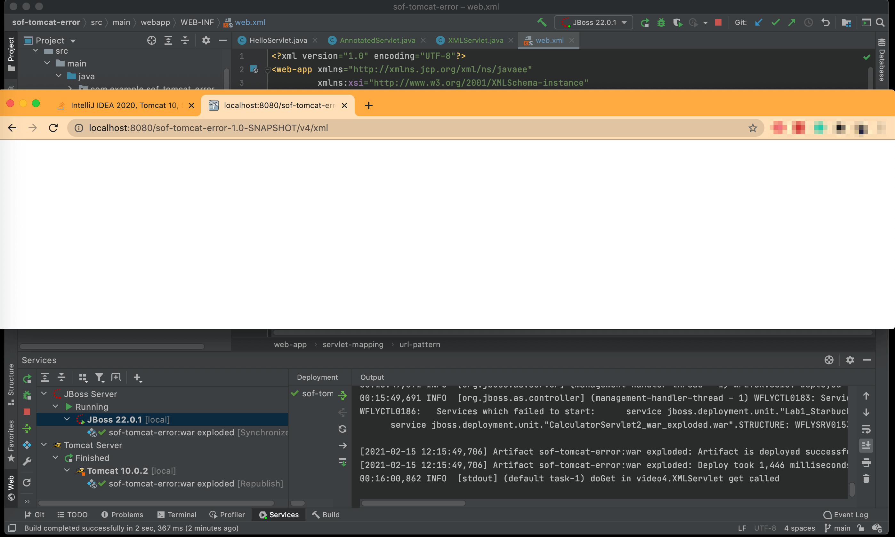

# Reproduce Tomcat Error

This is a demo & reproduce the problem on this question: https://stackoverflow.com/questions/66198579/intellij-idea-2020-tomcat-10-servlet-http-status-404-not-found

**UPDATE:**
- This question already has answers here: https://stackoverflow.com/questions/66198579/intellij-idea-2020-tomcat-10-servlet-http-status-404-not-found
- You need `jakarta.servlet.*` instead. - BalusC

# Setup

- IDE: IntelliJ IDEA 2020.3.2 Ultimate Edition
- Server: Tomcat 10.0.2
- Server: JBoss 22.0.1

# Hello World project

- Create new project:
  
  

- Tomcat configuration:
  

# Run on Tomcat

Notes: it works fine when running on JBoss:

# Mapping Servlets to URL Patterns

Following this tutorial: https://youtu.be/DZdtFlLi_I4

- Still getting error with Tomcat:
  
- Although it works fine when running on JBoss:
  
